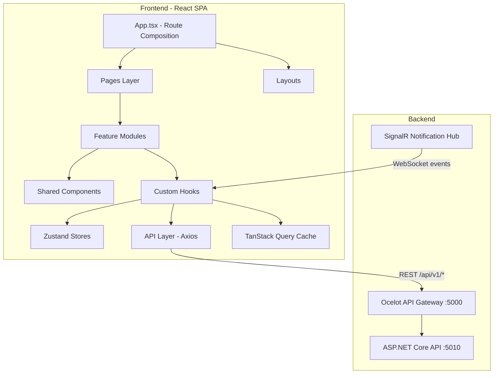
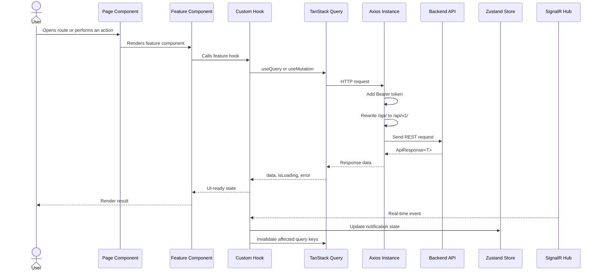
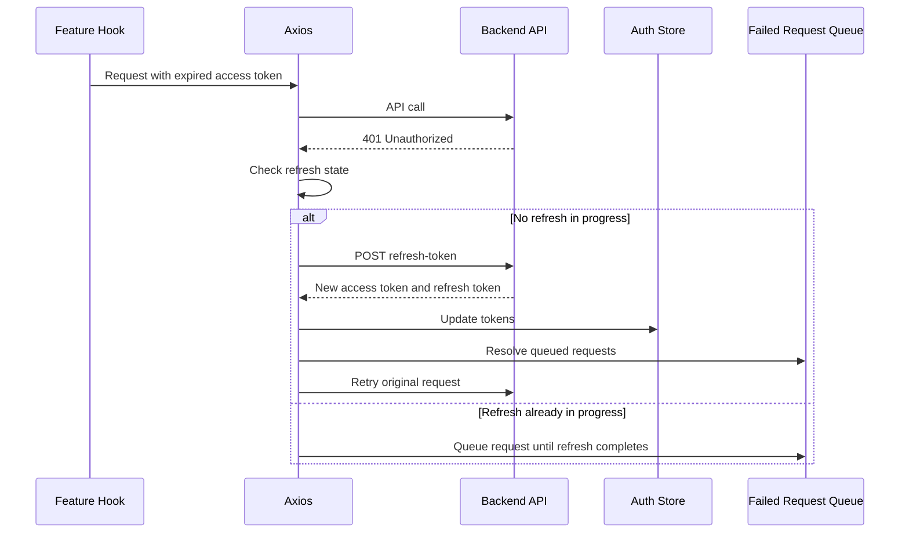
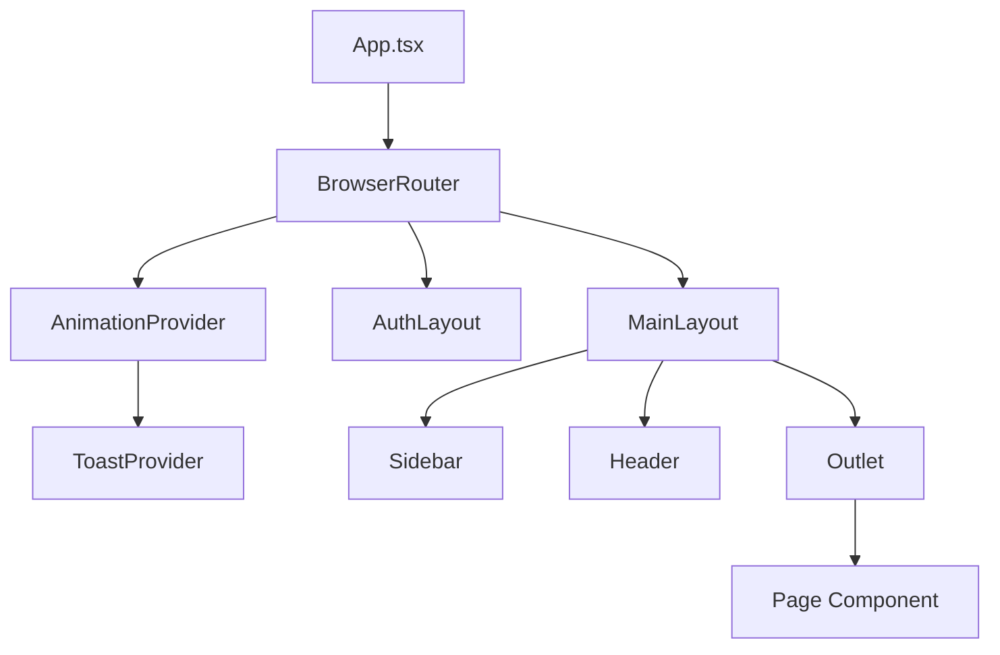

# Frontend Architecture Guide - MangaPress

> **Author / Owner**: Phuc  
> **Project**: Manga Publishing System (MangaPress)  
> **Created**: 2026-07-14  
> **Purpose**: Assessment 03 checkpoint preparation and frontend architecture explanation  
> **Audience**: Lecturer, project reviewers, Software Engineering students, and new frontend contributors

---

## Table of Contents

1. [Architecture Overview](#1-architecture-overview)
2. [Technology Stack and Dependencies](#2-technology-stack-and-dependencies)
3. [Folder Structure](#3-folder-structure)
4. [Data Flow](#4-data-flow)
5. [Authentication and Authorization](#5-authentication-and-authorization)
6. [Layout and Routing System](#6-layout-and-routing-system)
7. [Feature Modules](#7-feature-modules)
8. [Real-Time Communication with SignalR](#8-real-time-communication-with-signalr)
9. [Shared Hooks, Utilities, and Components](#9-shared-hooks-utilities-and-components)
10. [Role-Based Demo Flows](#10-role-based-demo-flows)
11. [Assessment and Interview Questions](#11-assessment-and-interview-questions)
12. [Final Preparation Checklist](#12-final-preparation-checklist)

---

## 1. Architecture Overview

MangaPress is implemented as a **React Single Page Application (SPA)**. The frontend is responsible for presenting role-specific workspaces, handling user interactions, communicating with the backend API gateway, managing client-side state, and reacting to real-time events.

The architecture follows a **feature-based structure**. Instead of grouping all components, hooks, and API calls by technical type only, the application groups business capabilities under `features/`. This is a deliberate design decision: the project has many workflows, and each workflow is easier to understand when its API calls, hooks, components, types, and utilities are colocated.



### Key Architectural Decisions

- **React SPA**: The application runs in the browser and changes pages through client-side routing without full page reloads.
- **Feature-based modules**: Each business capability owns its API calls, hooks, components, types, constants, and utilities.
- **React Router**: The route tree separates public pages, authentication pages, and role-protected workspaces.
- **TanStack Query**: Server-owned data is cached, refetched, retried, and invalidated through query keys.
- **Zustand**: Client-owned global state is used for authentication, canvas tool state, and notifications.
- **Axios**: HTTP communication is centralized through one configured Axios instance with interceptors.
- **SignalR**: Real-time backend events update notification state and invalidate relevant query caches.
- **Tailwind CSS and CSS variables**: Styling is consistent, tokenized, and practical for a large dashboard-style application.

### Why This Architecture Works

The frontend is not only a set of screens. It is a workflow application. Mangaka, Assistants, Editors, Board members, and Admins all interact with different parts of the same business domain. A feature-based architecture keeps those workflows understandable and maintainable.

For example, the `tasks` feature contains task API calls, task hooks, task UI components, task constants, and task types. A developer who needs to update task behavior can work mostly inside one bounded area instead of searching across the entire project.

---

## 2. Technology Stack and Dependencies

| Area | Library / Tool | Version | Responsibility |
|---|---|---:|---|
| UI framework | React | 19.x | Component-based user interface |
| Language | TypeScript | 6.x | Static typing and safer API contracts |
| Build tool | Vite | 8.x | Development server and production bundling |
| Routing | react-router-dom | 7.x | Client-side routing and nested layouts |
| Global client state | Zustand | 5.x | Lightweight global state stores |
| Server state | TanStack React Query | 5.x | API caching, refetching, loading state, and invalidation |
| HTTP client | Axios | 1.x | REST API requests and interceptors |
| Real-time | @microsoft/signalr | 10.x | WebSocket-based notifications and live updates |
| Styling | Tailwind CSS | 3.x | Utility-first styling |
| Animation | Framer Motion | 12.x | Page transitions and micro-interactions |
| Canvas | Fabric.js | 7.x | Manga page canvas, regions, and annotations |
| Charts | Recharts | 3.x | Dashboard and ranking visualizations |
| Icons | lucide-react | 0.445 | Consistent icon system |
| Toasts | react-hot-toast | 2.x | User feedback notifications |
| UI primitives | Radix UI, class-variance-authority | - | Accessible UI primitives and class variants |
| API type generation | openapi-typescript | 7.x | TypeScript types generated from backend Swagger/OpenAPI |

### Why Type Generation Matters

The frontend imports generated DTO types from the backend OpenAPI schema. This reduces integration risk between frontend and backend. If the backend changes a field name or response shape, TypeScript can catch many mismatches during development.

Command:

```bash
npm run generate-api
```

This command generates API schema/types from backend Swagger and places them under `src/api/generated/`.

### Senior Engineering View

The stack separates state ownership:

- **React state** owns local UI state.
- **Zustand** owns global client state.
- **TanStack Query** owns server state.
- **Axios** owns transport behavior.
- **React Router** owns navigation state.

This separation prevents the common frontend anti-pattern of putting all application state into one global store.

---

## 3. Folder Structure

```text
frontend/src/
|-- main.tsx                  # Entry point; creates React root and QueryClientProvider
|-- App.tsx                   # Main route tree and top-level providers
|
|-- api/                      # Shared API layer
|   |-- axios.ts              # Axios instance and interceptors
|   |-- apiResponse.ts        # Helpers for ApiResponse<T>
|   `-- generated/            # Generated OpenAPI TypeScript types
|       |-- schema.ts
|       `-- types.ts
|
|-- stores/                   # Zustand global stores
|   |-- authStore.ts          # User, access token, refresh token, remember-me state
|   |-- notificationStore.ts  # Notification list, unread count, dropdown state
|   `-- canvasStore.ts        # Canvas tools, zoom, selection, annotation type
|
|-- routes/
|   `-- RoleGuard.tsx         # Route-level authentication and role protection
|
|-- layouts/
|   |-- MainLayout.tsx        # Sidebar, header, content outlet, SignalR initialization
|   |-- AuthLayout.tsx        # Login/register page layout
|   |-- Sidebar.tsx           # Role-aware navigation
|   |-- Header.tsx            # Top bar, notifications, user dropdown
|   `-- UserDropdown.tsx      # User menu and logout actions
|
|-- pages/                    # Route-level page components
|   |-- landing/
|   |-- auth/
|   |-- mangaka/
|   |-- assistant/
|   |-- editor/
|   |-- board/
|   |-- admin/
|   `-- wallet/
|
|-- features/                 # Business feature modules
|   |-- auth/
|   |-- landing/
|   |-- dashboard/
|   |-- series/
|   |-- canvas/
|   |-- tasks/
|   |-- wallet/
|   |-- review/
|   |-- voting/
|   |-- ranking/
|   |-- schedule/
|   |-- contracts/
|   |-- notifications/
|   |-- users/
|   |-- admin/
|   |-- portfolio/
|   |-- assistant-profile/
|   |-- assistant-management/
|   |-- disputes/
|   |-- reconciliation/
|   |-- withdraw-approval/
|   |-- settings/
|   `-- ai/
|
|-- components/               # Shared UI components
|   |-- common/
|   `-- canvas/
|
|-- hooks/                    # Shared reusable hooks
|   |-- useSignalR.ts
|   |-- usePagination.ts
|   |-- useClickOutside.ts
|   |-- useDebounce.ts
|   |-- useScrollReveal.ts
|   `-- useWindowSize.ts
|
|-- types/                    # Global TypeScript exports
|-- utils/                    # Cross-feature utility functions
|-- constants/                # Application-wide constants
`-- styles/                   # CSS entry, variables, reset, animations
```

### Feature Module Convention

Most feature modules follow this convention:

```text
features/<feature-name>/
|-- api/           # Axios-based API calls
|-- components/    # Feature-specific UI components
|-- hooks/         # React Query hooks and business UI logic
|-- types/         # TypeScript interfaces and type aliases
|-- constants/     # Options, labels, status values
|-- utils/         # Feature-specific helper functions
`-- index.ts       # Barrel export for the feature public API
```

### Why This Structure Is Used

This structure optimizes for change. When the task workflow changes, most changes should happen inside `features/tasks`. When wallet behavior changes, most changes should happen inside `features/wallet`. This reduces accidental coupling and makes code review easier.

---

## 4. Data Flow



### Detailed Explanation

1. A user opens a page or clicks an action.
2. React Router renders the matching page component.
3. The page composes a feature component.
4. The feature component calls a custom hook.
5. The hook uses TanStack Query for server state or Zustand for client state.
6. The feature API function calls the shared Axios instance.
7. Axios attaches authentication headers and rewrites API gateway paths.
8. The backend returns a normalized `ApiResponse<T>`.
9. React Query caches the data and exposes loading/error states.
10. The UI renders data, loading, empty, or error states.
11. SignalR events can invalidate query caches so the UI refreshes automatically.

### Why This Flow Is Important

The application avoids direct API calls inside arbitrary UI components. Instead, network access is routed through feature APIs and hooks. This creates a clean separation between rendering and data orchestration.

---

## 5. Authentication and Authorization

Authentication identifies the current user. Authorization determines whether that user can access a route or perform an action.

### 5.1 Auth Store

File: `src/stores/authStore.ts`

The auth store contains:

- `user`
- `token`
- `refreshToken`
- `isLoading`
- `rememberMe`
- `setAuth`
- `logout`
- `isAuthenticated`
- `getRoleRedirectPath`
- `updateUser`

The store uses Zustand with persistence. If `rememberMe` is enabled, auth state is stored in `localStorage`. Otherwise, it is stored in `sessionStorage`.

### 5.2 Automatic Token Refresh

File: `src/api/axios.ts`



The refresh queue prevents multiple simultaneous requests from starting multiple refresh-token calls. This is important because refresh-token rotation can invalidate old refresh tokens.

### 5.3 Route Guard

File: `src/routes/RoleGuard.tsx`

`RoleGuard` protects route groups:

```tsx
<Route element={<RoleGuard allowedRoles={['Mangaka']} />}>
  <Route element={<MainLayout />}>
    <Route path="/mangaka" element={<MangakaDashboardPage />} />
  </Route>
</Route>
```

Rules:

- If the user is not authenticated, redirect to `/login`.
- If the user has the wrong role, redirect to `/unauthorized`.
- If the user has the allowed role, render the nested route with `<Outlet />`.

### Important Security Note

Frontend authorization improves user experience but is not a complete security control. Backend APIs must still enforce authorization because browser code can be inspected or modified.

---

## 6. Layout and Routing System

### 6.1 Layout System



#### `MainLayout`

`MainLayout` is used for authenticated workspaces. It includes:

- Sidebar navigation.
- Header.
- Page content outlet.
- SignalR initialization through `useSignalR()`.
- Responsive behavior for sidebar collapse and mobile drawer.

#### `AuthLayout`

`AuthLayout` is used for authentication pages:

- Login.
- Register.
- Forgot password.
- Reset password.

This separates public/auth pages from the main dashboard shell.

### 6.2 Route Groups

| Route Group | Role | Main Pages |
|---|---|---|
| `/` | Public | Landing page |
| `/login`, `/register` | Public | Authentication |
| `/mangaka/*` | Mangaka | Dashboard, series, manuscripts, tasks, wallet, canvas |
| `/assistant/*` | Assistant | Dashboard, task queue, invites, portfolio, profile, wallet |
| `/editor/*` | Editor | Dashboard, series review, chapter review, annotations, disputes |
| `/board/*` | Board | Dashboard, voting, ranking, schedule |
| `/admin/*` | Admin | Dashboard, users, contracts, reconciliation, withdrawal approval |
| `/wallet/deposit/callback` | Public callback | VNPay return page |

### Why Routes Are Split by Role

The same entity can mean different things to different users. A task for a Mangaka is something to assign and approve. A task for an Assistant is something to accept and submit. Role-specific routes keep user intent clear.

---

## 7. Feature Modules

This section explains the main feature modules and why each exists.

### 7.1 Landing Page

Folder: `features/landing`

Purpose:

- Presents the product entry point.
- Introduces roles and workflow.
- Provides navigation to login/register.
- Contains sections such as hero, features, roles, workflow, contact, and footer.

Why it exists:

The landing page is the public-facing entry point. It separates marketing/onboarding content from authenticated workflow screens.

### 7.2 Auth

Folder: `features/auth`

Key files:

- `api/auth.api.ts`
- `components/LoginForm.tsx`
- `components/RegisterForm.tsx`
- `components/ForgotPasswordForm.tsx`
- `components/ResetPasswordForm.tsx`
- `hooks/useRegisterForm.ts`
- `utils/rememberCredentials.ts`

Responsibilities:

- Login.
- Assistant registration.
- OTP verification.
- Forgot/reset password.
- Change password.
- Remember-me behavior.

Why it exists:

Authentication is a cross-cutting workflow. It must coordinate forms, backend API calls, token storage, role mapping, redirects, and user feedback.

### 7.3 Dashboard

Folder: `features/dashboard`

Responsibilities:

- Role-specific dashboard cards and charts.
- Admin, Assistant, Board, Editor, and Mangaka dashboard views.
- Chart components built with Recharts.

Why it exists:

Each role needs different operational metrics. A shared dashboard feature allows common chart and stat components while still supporting role-specific data.

### 7.4 Series

Folder: `features/series`

Core responsibilities:

- Create and manage manga series.
- Upload covers and manuscripts.
- Manage chapters and pages.
- Submit series for review.
- View series status timeline.
- Manage team invitations.
- Edit budget-related information.

Important components:

- `CreateSeriesForm`
- `SeriesListFeature`
- `SeriesDetailFeature`
- `ChapterDetailFeature`
- `UploadChapterModal`
- `AddPagesModal`
- `SeriesTeamPanel`
- `StatusTimeline`

Why it exists:

Series is the central content aggregate in the application. Many workflows depend on it: review, voting, ranking, contracts, chapters, pages, and tasks.

### 7.5 Canvas

Folders:

- `features/canvas`
- `components/canvas`

Core responsibilities:

- Display manga pages.
- Allow pan and zoom.
- Draw and manage regions.
- Review annotations.
- Support task-related visual workflows.

Important components:

- `CanvasViewer`
- `CanvasToolbar`
- `MobileCanvasWarning`
- `AnnotationPinPanel`
- `PageCanvasFeature`
- `AnnotationReviewFeature`

Why Fabric.js is used:

Fabric.js provides object-based canvas editing. Regions and annotations can be represented as selectable and editable objects rather than raw pixels. This is important for assigning precise page areas to Assistants.

Typical region flow:

```text
1. Load a manga page into the canvas.
2. Select the Region tool.
3. Draw a rectangular or freeform area.
4. Save region coordinates through the API.
5. Use that region when creating a task for an Assistant.
```

### 7.6 Tasks

Folder: `features/tasks`

Responsibilities:

- Mangaka creates tasks.
- Assistant views available tasks.
- Assistant accepts tasks.
- Assistant submits work.
- Mangaka approves, rejects, requests revision, or reports disputes.
- Task versions and annotations are displayed.

Why it exists:

Tasks connect creative production with collaboration and payment. This feature is one of the main workflow engines of the frontend.

### 7.7 Wallet

Folder: `features/wallet`

Responsibilities:

- Display wallet balances.
- Display transaction history.
- Start deposit flow.
- Handle VNPay callback.
- Request withdrawal.
- Listen to wallet-related real-time updates.

Why it exists:

Money movement requires a dedicated UI because balances, locked funds, withdrawals, and transaction history must be visible and auditable.

### 7.8 Review

Folder: `features/review`

Responsibilities:

- Editor reviews series and chapters.
- QC checklist and review queue.
- Annotation and revision workflows.

Why it exists:

Publishing workflows require editorial quality control. This feature separates review responsibilities from content creation responsibilities.

### 7.9 Voting

Folder: `features/voting`

Responsibilities:

- Board members view series dossiers.
- Board members vote approve/reject.
- Voting progress is displayed.

Why it exists:

Board decisions are governance actions. They should be represented as explicit workflows rather than informal comments.

### 7.10 Ranking

Folder: `features/ranking`

Responsibilities:

- Display ranking tables and charts.
- Input ranking data.
- Normalize ranking values for presentation.

Why it exists:

Ranking information supports publication and business decisions. It is separated from normal series CRUD because it has a reporting/analytics purpose.

### 7.11 Schedule

Folder: `features/schedule`

Responsibilities:

- Manage or display publishing schedules.
- Support board-level planning.

Why it exists:

Publishing requires calendar-based coordination. Schedule data helps decision makers understand release timing.

### 7.12 Contracts

Folder: `features/contracts`

Responsibilities:

- Display and manage contracts.
- Support contract-related workflows.

Why it exists:

Contracts formalize production and publication agreements. They are operational records, not just UI documents.

### 7.13 Notifications

Folder: `features/notifications`

Responsibilities:

- Fetch notifications.
- Display notification dropdown.
- Mark notifications as read.
- Integrate with SignalR updates.

Why it exists:

Notifications connect asynchronous workflows. Users should know when tasks, wallets, reviews, or system events change.

### 7.14 Users and Admin

Folders:

- `features/users`
- `features/admin`

Responsibilities:

- Manage users.
- Approve or reject accounts.
- Configure board voting rules.
- Manage administrative system settings.

Why it exists:

Administrative workflows require higher privilege and must be separated from normal role workflows.

### 7.15 Portfolio and Assistant Profile

Folders:

- `features/portfolio`
- `features/assistant-profile`

Responsibilities:

- Assistant uploads portfolio samples.
- Assistant maintains professional profile.
- Mangaka and system users can assess Assistant capability.

Why it exists:

Assistant matching depends on skills, experience, samples, and profile quality.

### 7.16 Reconciliation and Withdraw Approval

Folders:

- `features/reconciliation`
- `features/withdraw-approval`

Responsibilities:

- Admin reconciles payment records.
- Admin reviews and approves withdrawal requests.
- Platform wallet information is displayed.

Why it exists:

Financial operations need administrative oversight, traceability, and explicit approval steps.

### 7.17 Settings

Folder: `features/settings`

Responsibilities:

- User profile editing.
- Avatar upload.
- Mangaka leave status.
- Account settings.

Why it exists:

Settings are cross-role user preferences and account maintenance workflows.

### 7.18 AI Features

Folder: `features/ai`

Responsibilities:

- Colorize image.
- Segment image.
- Suggest tags.

Why it exists:

AI assists creative and metadata workflows. It is separated into its own feature to prevent AI-specific integration logic from leaking into unrelated modules.

### 7.19 Disputes

Folder: `features/disputes`

Responsibilities:

- Editor reviews disputes.
- Dispute status and decision workflows are displayed.

Why it exists:

Creative work and payments can produce conflicts. Dispute workflows need transparent handling.

### 7.20 Assistant Management

Folder: `features/assistant-management`

Responsibilities:

- Mangaka browses Assistants.
- Mangaka invites Assistants to a series team.
- Assistant invitation responses are displayed.
- Team composition is managed.

Why it exists:

Production depends on collaboration. Assistant management connects talent discovery with series staffing.

---

## 8. Real-Time Communication with SignalR

### 8.1 Connection Location

SignalR is initialized in `MainLayout` by calling `useSignalR()`. This is intentional because `MainLayout` wraps authenticated pages. The connection starts only after login and is shared across role workspaces.

### 8.2 Hub URL Resolution

The hub URL is resolved from environment variables or development defaults:

```ts
const getHubUrl = () => {
  if (import.meta.env.VITE_SIGNALR_URL) return import.meta.env.VITE_SIGNALR_URL;
  if (import.meta.env.DEV && !import.meta.env.VITE_API_URL) {
    return '/api/v1/hubs/notification';
  }
  return `${import.meta.env.VITE_API_URL}/api/v1/hubs/notification`;
};
```

### 8.3 Events

The hook listens for events such as:

| Event | Purpose |
|---|---|
| `NewNotification` | Adds notification and may show toast |
| `TaskStatusChanged` | Refreshes task-related data |
| `WalletUpdated` | Refreshes wallet data |
| `UnreadCountUpdated` | Updates unread notification count |

### 8.4 Smart Invalidation

When real-time events arrive, the app does not manually patch every UI object. Instead, it invalidates relevant TanStack Query keys. React Query then refetches the authoritative data from the backend.

Example:

```text
SignalR receives WalletUpdated
-> notificationStore updates notification badge
-> queryClient.invalidateQueries(['wallet'])
-> wallet UI refetches and re-renders
```

### 8.5 Toast Suppression

Some events are triggered by the current user's own action. Showing an extra real-time toast for the same action would create duplicate feedback. The hook suppresses some notification types to avoid noisy UX.

---

## 9. Shared Hooks, Utilities, and Components

### Shared Hooks

| Hook | Responsibility |
|---|---|
| `useSignalR` | SignalR connection, event handling, cache invalidation |
| `usePagination` | Client-side pagination and ellipsis page range |
| `useClickOutside` | Detect click outside an element |
| `useDebounce` | Delay value updates for search/input |
| `useScrollReveal` | Trigger animation when an element enters viewport |
| `useWindowSize` | Reactive window dimensions |

### Utilities

| Utility | Responsibility |
|---|---|
| `currency.ts` | Format currency values |
| `status.ts` | Normalize status values and map labels/colors |
| `parseApiDate.ts` | Parse API date strings |
| `resolveMediaUrl.ts` | Resolve image/media URLs |
| `notificationLink.ts` | Build links from notification types |
| `roleDisplay.ts` | Map role values to display labels |
| `fixMojibake.ts` | Repair encoding issues in display text |
| `validatePngTransparent.ts` | Validate transparent PNG uploads |
| `appToast.tsx` | Toast helper wrapper |
| `shadcn.ts` | Class name merge helper |

### Shared Components

| Component | Responsibility |
|---|---|
| `Pagination` | Page navigation UI |
| `CustomSelect` | Reusable select dropdown |
| `CustomDatePicker` | Date input UI |
| `PageScaffold` | Common page wrapper |
| `Logo` | Brand logo component |
| `HelpTip` | Tooltip helper |
| `ToastProvider` | Toast rendering container |
| `animation/` | Page and element animation utilities |

### Why Shared Code Must Be Controlled

Shared code should only contain genuinely reusable behavior. If a helper is only meaningful for one feature, it should stay inside that feature. This prevents `utils/` and `components/common/` from becoming dumping grounds.

---

## 10. Role-Based Demo Flows

### 10.1 Mangaka Demo

```text
1. Log in with a Mangaka account.
2. Open Dashboard and explain overview statistics.
3. Open Series and create a new manga series.
4. Upload cover/name/manuscript information.
5. Submit the series for Editor review.
6. After approval, upload a chapter.
7. Add pages to the chapter.
8. Open Canvas and draw regions on a manga page.
9. Create tasks for Assistants based on selected regions.
10. Review Assistant submissions.
11. Submit chapter for Editor review.
12. Open Wallet and demonstrate deposit flow.
13. Invite Assistants to the series team.
```

### 10.2 Assistant Demo

```text
1. Log in with an Assistant account.
2. Open Dashboard.
3. Open Invites and respond to a Mangaka invitation.
4. Open Task Queue and accept an available task.
5. Open task detail, inspect assigned region, and submit work.
6. Open Portfolio and upload a sample.
7. Open Profile and update professional information.
8. Open Wallet and review income/withdrawal actions.
```

### 10.3 Editor Demo

```text
1. Log in with an Editor account.
2. Open Dashboard.
3. Open Series Review and approve/reject/request revision.
4. Open Chapter Review and explain QC/annotation workflow.
5. Open Disputes and explain dispute resolution.
```

### 10.4 Board Demo

```text
1. Log in with a Board account.
2. Open Dashboard.
3. Open Voting and vote on a series.
4. Open Ranking and explain ranking data.
5. Open Ranking Data and input/update ranking values.
6. Open Schedule and review publishing schedule.
```

### 10.5 Admin Demo

```text
1. Log in with an Admin account.
2. Open Dashboard.
3. Open Users and explain account management.
4. Open Contracts and review contract records.
5. Open Reconciliation and explain transaction reconciliation.
6. Open Withdraw Approval and approve/reject withdrawal requests.
7. Open Board Voting and explain voting configuration.
```

---

## 11. Assessment and Interview Questions

### Architecture and Structure

**Q: Why does this project use feature-based architecture instead of a simple MVC-style folder structure?**

Because the frontend contains many business workflows. Feature-based architecture colocates API calls, hooks, components, types, constants, and utilities for each workflow. This improves maintainability, reduces cross-folder searching, and allows team members to work independently on separate features.

**Q: Explain the data flow from user action to rendered data.**

User action triggers a route or event. The page renders a feature component. The feature calls a custom hook. The hook uses TanStack Query and a feature API function. The feature API uses the shared Axios instance. Axios adds token and gateway prefix. The backend returns `ApiResponse<T>`. React Query caches the result and returns loading/error/data state to the component.

**Q: Why is Zustand used instead of Redux?**

Zustand is lightweight and sufficient for the project's global client state: auth, notifications, and canvas state. Server state is not stored in Zustand because TanStack Query is better suited for caching, refetching, retry, and invalidation.

### Authentication

**Q: How does refresh-token handling work?**

When an API call returns 401, Axios checks whether a refresh is already running. If not, it calls the refresh-token endpoint, updates the auth store, and retries the original request. If a refresh is already running, the request waits in a queue. If refresh fails, the user is logged out and redirected to `/login`.

**Q: How does Remember Me work?**

The auth store uses a custom storage adapter. With Remember Me enabled, auth data is persisted to `localStorage`. Without Remember Me, auth data is stored in `sessionStorage`, which is cleared when the browser session ends.

**Q: Is frontend authorization enough?**

No. `RoleGuard` prevents incorrect navigation and improves UX, but real security must be enforced by backend authorization. Frontend code can be inspected or manipulated.

### Real-Time

**Q: Where is SignalR connected?**

SignalR is initialized in `MainLayout`, which wraps authenticated pages. This ensures one connection is available across the authenticated workspace.

**Q: How does the UI update after a SignalR event?**

The event handler updates notification state if needed and invalidates relevant TanStack Query keys. React Query then refetches authoritative backend data and re-renders affected UI.

**Q: How does reconnect work?**

SignalR is configured with automatic reconnect intervals. This allows the app to recover from temporary network interruptions without forcing the user to reload the page.

### Canvas

**Q: Why use Fabric.js for the canvas editor?**

Fabric.js provides object-based canvas editing. Regions and annotations can be selected, moved, resized, and serialized as objects. This is more maintainable than raw pixel manipulation.

**Q: Explain the region drawing workflow.**

The user loads a manga page, selects the region tool, draws a region, saves region coordinates through the API, and then uses that region when creating a task for an Assistant.

### API Layer

**Q: Why use generated API types?**

Generated types reduce contract mismatch between frontend and backend. They make DTO fields explicit and allow TypeScript to detect many integration errors during development.

**Q: What do Axios interceptors do?**

The interceptors rewrite `/api/` to `/api/v1/`, attach the Bearer token, handle 401 responses, refresh tokens, queue concurrent failed requests, and retry original requests.

**Q: What do API response helpers do?**

They extract `data`, `message`, validation errors, and paged result information from the backend's consistent `ApiResponse<T>` structure.

### UX and Performance

**Q: Is the application responsive?**

Yes. Tailwind breakpoints are used for responsive layouts. Sidebar supports mobile mode. Canvas workflows are optimized for larger screens and display a mobile warning when necessary.

**Q: What performance techniques are used?**

The app uses TanStack Query caching, query invalidation, memoized derived values, selective polling, SignalR push updates, and cleanup of external resources such as Blob URLs and WebSocket connections.

**Q: How does pagination work?**

The app supports server-side pagination from backend `PagedResult<T>` responses and client-side pagination through `usePagination()` for local arrays.

---

## 12. Final Preparation Checklist

Before the assessment demo:

1. Be ready to explain the feature-based architecture.
2. Be ready to draw the data flow from page to hook to Axios to backend.
3. Understand the difference between Zustand and TanStack Query.
4. Understand how token refresh and failed-request queueing work.
5. Know why `RoleGuard` is only a frontend UX guard, not final security.
6. Practice the Mangaka, Assistant, Editor, Board, and Admin demo flows.
7. Prepare test data for series, tasks, wallets, notifications, and review workflows.
8. Highlight the strongest technical features: Canvas, SignalR, token refresh, generated API types, and role-based routing.

This guide was prepared from the frontend codebase and is intended to help explain the architecture clearly during assessment and technical review.
