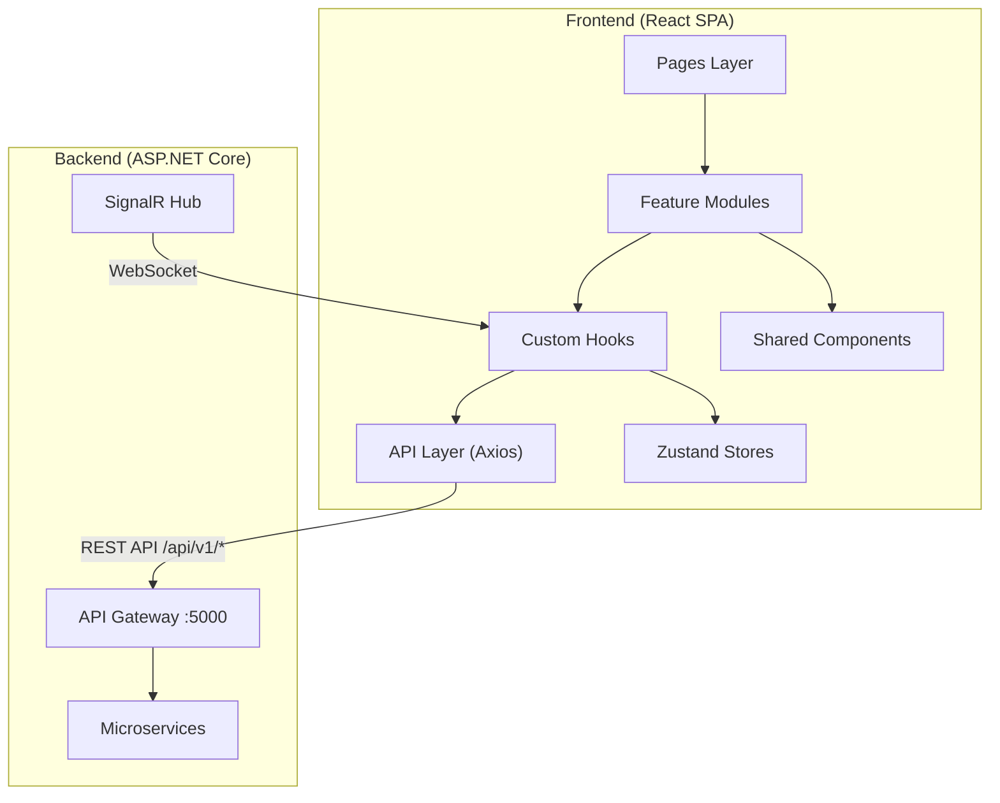
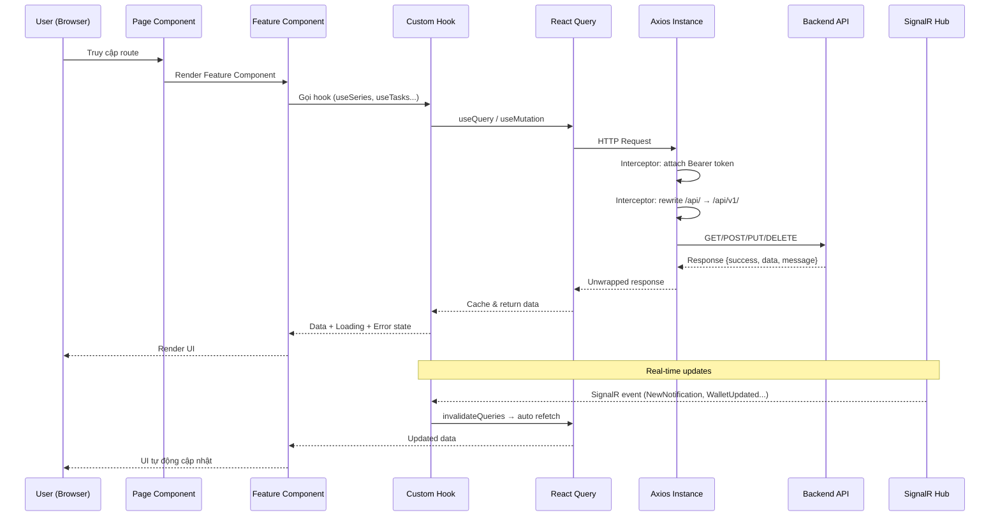
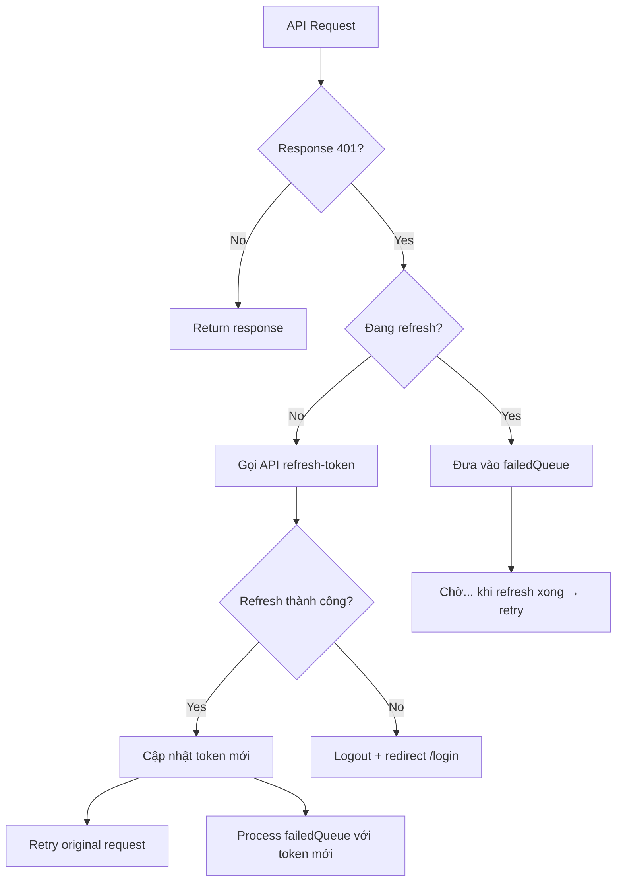
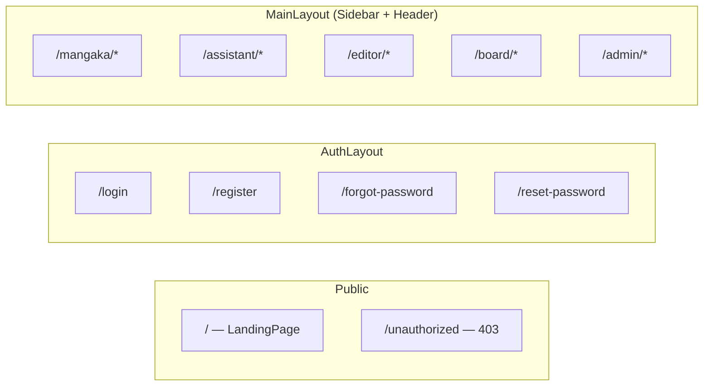

# 📖 Tài liệu Mô tả Frontend — MangaPress

> **Người xây dựng**: Phúc  
> **Dự án**: Hệ thống Xuất bản Manga (MangaPress)  
> **Ngày tạo**: 14/07/2026  
> **Mục đích**: Chuẩn bị cho buổi chấm Assessment 03 — Checkpoint (Week 9-10)

---

## 📑 Mục lục

1. [Tổng quan Kiến trúc](#1-tổng-quan-kiến-trúc)
2. [Tech Stack & Dependencies](#2-tech-stack--dependencies)
3. [Cấu trúc Thư mục](#3-cấu-trúc-thư-mục)
4. [Luồng Dữ liệu (Data Flow)](#4-luồng-dữ-liệu-data-flow)
5. [Hệ thống Authentication & Authorization](#5-hệ-thống-authentication--authorization)
6. [Hệ thống Layout & Routing](#6-hệ-thống-layout--routing)
7. [Các Feature Module chi tiết](#7-các-feature-module-chi-tiết)
   - 7.1 [Landing Page](#71-landing-page)
   - 7.2 [Auth (Đăng nhập/Đăng ký)](#72-auth-đăng-nhậpđăng-ký)
   - 7.3 [Dashboard (Bảng tin)](#73-dashboard-bảng-tin)
   - 7.4 [Series (Quản lý bộ truyện)](#74-series-quản-lý-bộ-truyện)
   - 7.5 [Canvas (Vẽ & Phân vùng trang)](#75-canvas-vẽ--phân-vùng-trang)
   - 7.6 [Tasks (Giao việc & Tiến độ)](#76-tasks-giao-việc--tiến-độ)
   - 7.7 [Wallet (Ví tiền)](#77-wallet-ví-tiền)
   - 7.8 [Review (Biên tập & Duyệt)](#78-review-biên-tập--duyệt)
   - 7.9 [Voting (Bỏ phiếu Hội đồng)](#79-voting-bỏ-phiếu-hội-đồng)
   - 7.10 [Ranking (Xếp hạng)](#710-ranking-xếp-hạng)
   - 7.11 [Schedule (Lịch xuất bản)](#711-schedule-lịch-xuất-bản)
   - 7.12 [Contracts (Hợp đồng)](#712-contracts-hợp-đồng)
   - 7.13 [Notifications (Thông báo real-time)](#713-notifications-thông-báo-real-time)
   - 7.14 [Users & Admin](#714-users--admin)
   - 7.15 [Portfolio & Assistant Profile](#715-portfolio--assistant-profile)
   - 7.16 [Reconciliation & Withdraw Approval](#716-reconciliation--withdraw-approval)
   - 7.17 [Settings (Cài đặt)](#717-settings-cài-đặt)
   - 7.18 [AI Features](#718-ai-features)
   - 7.19 [Disputes (Tranh chấp)](#719-disputes-tranh-chấp)
   - 7.20 [Assistant Management](#720-assistant-management)
8. [Hệ thống Real-time (SignalR)](#8-hệ-thống-real-time-signalr)
9. [Shared Hooks & Utilities](#9-shared-hooks--utilities)
10. [Luồng Demo theo vai trò](#10-luồng-demo-theo-vai-trò)
11. [Các câu hỏi Cô có thể hỏi & Gợi ý trả lời](#11-các-câu-hỏi-cô-có-thể-hỏi--gợi-ý-trả-lời)

---

## 1. Tổng quan Kiến trúc



**Kiến trúc tổng thể:**
- **Frontend** là một Single Page Application (SPA) dùng React + TypeScript
- **Kiến trúc Feature-based**: Mỗi tính năng nghiệp vụ được đóng gói thành 1 feature module riêng biệt
- **Giao tiếp**: REST API qua Axios + Real-time qua SignalR WebSocket
- **State Management**: Zustand cho global state (auth, notifications, canvas)
- **Server State**: TanStack React Query cho caching, sync và invalidation

---

## 2. Tech Stack & Dependencies

| Thành phần | Thư viện | Phiên bản | Vai trò |
|---|---|---|---|
| **Framework** | React | 19.x | UI Library chính |
| **Language** | TypeScript | 6.x | Type-safe JavaScript |
| **Build Tool** | Vite | 8.x | Dev server + bundler |
| **Routing** | react-router-dom | 7.x | Client-side routing |
| **State (Global)** | Zustand | 5.x | Lightweight state management |
| **State (Server)** | TanStack React Query | 5.x | Caching & server state sync |
| **HTTP Client** | Axios | 1.x | REST API calls |
| **Real-time** | @microsoft/signalr | 10.x | WebSocket notifications |
| **Styling** | TailwindCSS | 3.x | Utility-first CSS |
| **Animation** | Framer Motion | 12.x | Page transitions & micro-animations |
| **Canvas** | Fabric.js | 7.x | Vẽ region, annotation trên trang manga |
| **Charts** | Recharts | 3.x | Dashboard charts |
| **Icons** | lucide-react | 0.445 | Icon system |
| **Toast** | react-hot-toast | 2.x | Notification toasts |
| **UI Primitives** | Radix UI, class-variance-authority | — | Accessible UI components |
| **API Gen** | openapi-typescript | 7.x | Tự sinh TypeScript types từ Swagger |

> [!IMPORTANT]
> **Điểm nổi bật**: Types TypeScript được **tự động sinh** từ Swagger/OpenAPI schema của backend (`npm run generate-api`), đảm bảo type-safe 100% giữa FE-BE.

---

## 3. Cấu trúc Thư mục

```
frontend/src/
├── main.tsx                  # Entry point — khởi tạo React, QueryClient
├── App.tsx                   # Routing chính — định nghĩa tất cả routes
│
├── api/                      # API Layer
│   ├── axios.ts              # Axios instance + interceptors (Auth, Refresh Token)
│   ├── apiResponse.ts        # Helper unwrap API response
│   └── generated/            # Auto-generated từ Swagger
│       ├── schema.ts         # OpenAPI schema types (242KB)
│       └── types.ts          # DTO interfaces dùng trong app
│
├── stores/                   # Zustand Global Stores
│   ├── authStore.ts          # Auth state (user, token, refreshToken)
│   ├── notificationStore.ts  # Notifications in-memory
│   └── canvasStore.ts        # Canvas tool state (activeTool, zoom, selection)
│
├── routes/
│   └── RoleGuard.tsx         # Route protection theo role
│
├── layouts/                  # Layout components
│   ├── MainLayout.tsx        # Sidebar + Header + Content (cho user đã login)
│   ├── AuthLayout.tsx        # Layout cho Login/Register
│   ├── Sidebar.tsx           # Navigation sidebar theo role
│   ├── Header.tsx            # Top bar + Breadcrumb + Notifications + UserDropdown
│   └── UserDropdown.tsx      # Menu user (Cài đặt, Đăng xuất)
│
├── pages/                    # Page components (thin wrappers)
│   ├── landing/              # Trang chủ
│   ├── auth/                 # Login, Register, Forgot/Reset Password
│   ├── mangaka/              # 11 pages cho Tác giả
│   ├── assistant/            # 8 pages cho Trợ lý vẽ
│   ├── editor/               # 7 pages cho Biên tập viên
│   ├── board/                # 6 pages cho Hội đồng
│   ├── admin/                # 8 pages cho Admin
│   └── wallet/               # DepositCallbackPage (VNPay redirect)
│
├── features/                 # Feature modules (CORE BUSINESS LOGIC)
│   ├── auth/                 # Đăng nhập, Đăng ký, Quên mật khẩu
│   ├── landing/              # Landing page sections
│   ├── dashboard/            # Dashboard cho 5 roles
│   ├── series/               # CRUD bộ truyện, chapters, pages
│   ├── canvas/               # Canvas editor (vẽ region, annotation)
│   ├── tasks/                # Giao việc, nhận việc, review
│   ├── wallet/               # Nạp/rút tiền, lịch sử giao dịch
│   ├── review/               # Editor duyệt chapter, QC
│   ├── voting/               # Board bỏ phiếu
│   ├── ranking/              # Xếp hạng truyện
│   ├── schedule/             # Lịch xuất bản
│   ├── contracts/            # Quản lý hợp đồng
│   ├── notifications/        # Dropdown thông báo
│   ├── users/                # Admin quản lý user
│   ├── admin/                # Admin board voting config
│   ├── portfolio/            # Portfolio của Assistant
│   ├── assistant-profile/    # Hồ sơ nghề nghiệp Assistant
│   ├── assistant-management/ # Mangaka tìm & mời Assistant
│   ├── disputes/             # Editor phân xử tranh chấp
│   ├── reconciliation/       # Admin đối soát giao dịch
│   ├── withdraw-approval/    # Admin duyệt rút tiền
│   ├── settings/             # Cài đặt chung
│   └── ai/                   # AI: colorize, segment, suggest tags
│
├── components/               # Shared UI components
│   ├── common/               # Logo, Pagination, Select, DatePicker, Toast...
│   └── canvas/               # CanvasViewer, CanvasToolbar, AnnotationPinPanel
│
├── hooks/                    # Shared hooks
│   ├── useSignalR.ts         # WebSocket connection (350 lines)
│   ├── usePagination.ts      # Client-side pagination logic
│   ├── useClickOutside.ts    # Click outside detector
│   ├── useDebounce.ts        # Debounce values
│   ├── useScrollReveal.ts    # Scroll animation
│   └── useWindowSize.ts      # Responsive breakpoints
│
├── types/                    # Global TypeScript type re-exports
├── utils/                    # Utility functions
├── constants/                # App-wide constants (genres, annotations...)
└── styles/                   # CSS files
    ├── index.css             # Main stylesheet entry
    ├── variables.css         # CSS custom properties
    ├── reset.css             # Browser reset
    └── animations.css        # Keyframe animations
```

> [!TIP]
> **Pattern quan trọng**: Mỗi feature module tuân theo cấu trúc nhất quán:
> ```
> features/<tên-feature>/
> ├── api/           # API calls (axios requests)
> ├── components/    # React components
> ├── hooks/         # Custom hooks (business logic + React Query)
> ├── types/         # TypeScript interfaces
> ├── constants/     # Config, options
> ├── utils/         # Helper functions
> └── index.ts       # Barrel export (public API)
> ```

---

## 4. Luồng Dữ liệu (Data Flow)



### Giải thích chi tiết:

1. **User truy cập route** → `App.tsx` match route → render `Page` component
2. **Page** là thin wrapper, chỉ import & render **Feature** component
3. **Feature component** gọi **custom hook** để lấy dữ liệu
4. **Hook** sử dụng **React Query** (`useQuery`/`useMutation`) để gọi API
5. **Axios interceptors** tự động:
   - Gắn `Authorization: Bearer <token>` vào mọi request
   - Rewrite URL `/api/` → `/api/v1/` cho API Gateway
   - **Auto refresh token** khi nhận 401 (Token Rotation)
6. **Response** được unwrap qua helper functions (`isApiSuccess`, `unwrapPaged`...)
7. **SignalR** push real-time events → hook nhận sự kiện → `invalidateQueries` → React Query tự fetch lại data mới

---

## 5. Hệ thống Authentication & Authorization

### 5.1 Auth Store ([authStore.ts](file:///d:/Manga/frontend/src/stores/authStore.ts))

```typescript
// State lưu trữ
interface AuthState {
  user: User | null;        // Thông tin user (id, email, fullName, role, avatar...)
  token: string | null;     // JWT Access Token
  refreshToken: string | null;  // Refresh Token
  rememberMe: boolean;      // Ghi nhớ đăng nhập
}

// 5 vai trò trong hệ thống
type UserRole = 'Admin' | 'Editor' | 'Mangaka' | 'Assistant' | 'Board';
```

**Cơ chế lưu trữ thông minh:**
- **Remember Me = true** → Lưu vào `localStorage` (persist sau khi đóng browser)
- **Remember Me = false** → Lưu vào `sessionStorage` (mất khi đóng tab)
- Sử dụng `customStorage` adapter: tìm data ở cả 2 storage, ghi đúng nơi

### 5.2 Token Refresh tự động ([axios.ts](file:///d:/Manga/frontend/src/api/axios.ts))



**Đặc biệt**: Hỗ trợ **concurrent requests** — nếu nhiều request cùng bị 401, chỉ refresh token 1 lần, các request khác xếp vào `failedQueue` và retry sau.

### 5.3 Route Guard ([RoleGuard.tsx](file:///d:/Manga/frontend/src/routes/RoleGuard.tsx))

```typescript
const RoleGuard = ({ allowedRoles }) => {
  // 1. Chưa đăng nhập → redirect /login
  if (!isAuthenticated()) return <Navigate to="/login" />;
  
  // 2. Sai role → redirect /unauthorized
  if (user && !allowedRoles.includes(user.role)) 
    return <Navigate to="/unauthorized" />;
  
  // 3. Đúng role → render children (Outlet)
  return <Outlet />;
};
```

Mỗi nhóm route được bọc bởi `RoleGuard`:
- `/mangaka/*` → chỉ role `Mangaka`
- `/assistant/*` → chỉ role `Assistant`
- `/editor/*` → chỉ role `Editor`
- `/board/*` → chỉ role `Board`
- `/admin/*` → chỉ role `Admin`

---

## 6. Hệ thống Layout & Routing

### 6.1 Layout System



**MainLayout** ([MainLayout.tsx](file:///d:/Manga/frontend/src/layouts/MainLayout.tsx)):
- **Sidebar** bên trái: navigation menu theo role, hỗ trợ collapse/expand
- **Header** bên trên: breadcrumb tự động, notification dropdown, user dropdown
- **Content area**: render page con qua `<Outlet />`
- **SignalR**: khởi tạo kết nối WebSocket (`useSignalR()`) ở đây → tất cả page con đều nhận real-time

**Sidebar** ([Sidebar.tsx](file:///d:/Manga/frontend/src/layouts/Sidebar.tsx)):
- **Responsive**: mobile có overlay + hamburger menu
- **Collapsible**: thu gọn thành icon only (72px) hoặc full (260px)
- **Dynamic nav**: `getNavSections(role)` trả về menu items theo role
- **Badge count**: hiển thị số lời mời chưa đọc cho Assistant

**Header** ([Header.tsx](file:///d:/Manga/frontend/src/layouts/Header.tsx)):
- **Auto breadcrumb**: parse URL path → map sang label tiếng Việt
- **Notification bell**: dropdown real-time
- **User dropdown**: avatar, tên, role, Cài đặt, Đăng xuất

### 6.2 Danh sách Routes đầy đủ

| Route | Role | Page | Mô tả |
|---|---|---|---|
| `/` | Public | LandingPage | Trang giới thiệu |
| `/login` | Public | LoginPage | Đăng nhập |
| `/register` | Public | RegisterPage | Đăng ký |
| `/forgot-password` | Public | ForgotPasswordPage | Quên mật khẩu |
| `/reset-password` | Public | ResetPasswordPage | Đặt lại mật khẩu |
| `/wallet/deposit/callback` | Public | DepositCallbackPage | VNPay redirect |
| `/mangaka` | Mangaka | Dashboard | Bảng tin tác giả |
| `/mangaka/series` | Mangaka | SeriesList | Danh sách bộ truyện |
| `/mangaka/series/create` | Mangaka | CreateSeries | Tạo bộ truyện mới |
| `/mangaka/series/:seriesId` | Mangaka | SeriesDetail | Chi tiết bộ truyện |
| `/mangaka/manuscripts` | Mangaka | Manuscripts | Quản lý bản thảo |
| `/mangaka/manuscripts/:chapterId` | Mangaka | ChapterDetail | Chi tiết chapter |
| `/mangaka/tasks` | Mangaka | Tasks | Giao việc & tiến độ |
| `/mangaka/assistants` | Mangaka | Assistants | Tìm cộng sự |
| `/mangaka/wallet` | Mangaka | Wallet | Quản lý doanh thu |
| `/mangaka/canvas/:chapterId` | Mangaka | Canvas | Vẽ, phân vùng trang |
| `/mangaka/settings` | Mangaka | Settings | Cài đặt |
| `/assistant` | Assistant | Dashboard | Bảng tin trợ lý |
| `/assistant/tasks` | Assistant | TaskQueue | Bảng việc làm |
| `/assistant/invites` | Assistant | Invites | Lời mời dự án |
| `/assistant/series-invites/:id` | Assistant | InviteRespond | Trả lời mời |
| `/assistant/portfolio` | Assistant | Portfolio | Hồ sơ tác phẩm |
| `/assistant/profile` | Assistant | Profile | Hồ sơ nghề nghiệp |
| `/assistant/wallet` | Assistant | Wallet | Thu nhập |
| `/assistant/settings` | Assistant | Settings | Cài đặt |
| `/editor` | Editor | Dashboard | Bảng tin biên tập |
| `/editor/series-review` | Editor | SeriesReview | Thẩm định dự án |
| `/editor/chapter-review` | Editor | ChapterReview | Biên tập chương |
| `/editor/review/:seriesId` | Editor | ReviewSeries | Duyệt bộ truyện |
| `/editor/annotations` | Editor | Annotations | Ghim lỗi |
| `/editor/disputes` | Editor | Disputes | Phân xử tranh chấp |
| `/editor/settings` | Editor | Settings | Cài đặt |
| `/board` | Board | Dashboard | Bảng tin hội đồng |
| `/board/voting` | Board | Voting | Bỏ phiếu |
| `/board/ranking` | Board | Ranking | Xếp hạng |
| `/board/ranking-data` | Board | RankingData | Nhập liệu xếp hạng |
| `/board/schedule` | Board | Schedule | Lịch xuất bản |
| `/board/settings` | Board | Settings | Cài đặt |
| `/admin` | Admin | Dashboard | Bảng tin admin |
| `/admin/users` | Admin | Users | Quản lý người dùng |
| `/admin/contracts` | Admin | Contracts | Hợp đồng |
| `/admin/reconciliation` | Admin | Reconciliation | Đối soát giao dịch |
| `/admin/withdraw-approval` | Admin | WithdrawApproval | Duyệt rút tiền |
| `/admin/board-voting` | Admin | BoardVoting | Cấu hình biểu quyết |
| `/admin/settings` | Admin | Settings | Cài đặt |

---

## 7. Các Feature Module chi tiết

### 7.1 Landing Page

**Thư mục**: `features/landing/`

**Components:**
| Component | Vai trò |
|---|---|
| `Navbar` | Navigation bar trên cùng |
| `HeroSection` | Banner chính với CTA |
| `FeaturesSection` | Giới thiệu tính năng |
| `WorkflowSection` | Quy trình làm việc |
| `RolesSection` | Mô tả 5 vai trò |
| `MangaShowcaseSection` | Showcase tác phẩm |
| `CTASection` | Call-to-Action |
| `Footer` | Footer |
| `BackToTop` | Nút scroll lên đầu |
| `SectionDivider` | Phân cách section |
| `PublisherContactModal` | Modal liên hệ NXB |

**Hooks**: `useScrollReveal` — animation hiện dần khi scroll vào viewport.

---

### 7.2 Auth (Đăng nhập/Đăng ký)

**Thư mục**: `features/auth/`

**Components (11 files):**
| Component | Chức năng |
|---|---|
| `LoginForm` | Form đăng nhập (email + password + remember me) |
| `LoginBackground` | Background animation cho trang login |
| `LoginPageLayout` | Layout 2 cột cho trang login |
| `RegisterForm` | Form đăng ký multi-step |
| `RegisterHeroPanel` | Panel hero bên trái khi đăng ký |
| `RegisterInput` | Input field riêng cho form đăng ký |
| `RegisterConfirmModal` | Modal xác nhận sau khi đăng ký |
| `StepIndicator` | Thanh tiến trình step đăng ký |
| `ForgotPasswordForm` | Form gửi email quên mật khẩu |
| `ResetPasswordForm` | Form đặt lại mật khẩu mới |
| `ChangePasswordModal` | Modal đổi mật khẩu (dùng trong Settings) |

**API** (`auth.api.ts`):
- `login(dto)` → Gọi POST `/api/auth/login`
- `register(dto)` → POST `/api/auth/register`
- `refreshToken(dto)` → POST `/api/auth/refresh-token`
- `logout(dto)` → POST `/api/auth/logout`
- `forgotPassword(email)` → POST
- `resetPassword(dto)` → POST

**Luồng đăng nhập:**
1. User nhập email + password
2. Gọi `authApi.login()` → nhận `{ token, refreshToken, user }`
3. Lưu vào `authStore.setAuth()` → tự lưu vào storage
4. `getRoleRedirectPath()` → redirect về dashboard tương ứng role

**Luồng đăng ký:**
1. Form multi-step: Thông tin cơ bản → Chọn role → Thông tin bổ sung
2. `authApi.register()` → nhận response
3. Hiện `RegisterConfirmModal` → redirect login

---

### 7.3 Dashboard (Bảng tin)

**Thư mục**: `features/dashboard/`

**Có 5 dashboard riêng cho 5 roles:**

| Component | Role | Nội dung |
|---|---|---|
| `MangakaDashboardFeature` | Mangaka | Stats tổng quan + series mới + hoạt động gần đây |
| `AssistantDashboardFeature` | Assistant | Stats + tasks gần đây |
| `EditorDashboardFeature` | Editor | Stats review + chapters cần duyệt |
| `BoardDashboardFeature` | Board | Stats voting + ranking |
| `AdminDashboardFeature` | Admin | Stats hệ thống + users + revenue |

**Shared:**
- `StatCard` — Card hiển thị metric (số, % thay đổi, icon, màu)
- Chart components trong `charts/` — biểu đồ Recharts

**Hooks**: Mỗi role có hook riêng (`useMangakaDashboard`, `useAdminDashboard`...) gọi API `/api/dashboard/{role}`.

---

### 7.4 Series (Quản lý bộ truyện) ⭐ CORE FEATURE

**Thư mục**: `features/series/` — **28 components** (lớn nhất)

**Đây là feature trung tâm**, bao gồm:

#### Danh sách & CRUD:
| Component | Chức năng |
|---|---|
| `SeriesListFeature` | Danh sách truyện + filter + pagination |
| `SeriesCard` / `SeriesRow` | Card/Row hiển thị thông tin truyện |
| `CreateSeriesForm` | Form tạo truyện mới (21KB — form phức tạp) |
| `SeriesDetailFeature` | Trang chi tiết bộ truyện |
| `SeriesInfoCard` | Card thông tin meta |
| `SeriesPreviewModal` | Modal xem trước truyện |
| `StatusTimeline` | Timeline trạng thái series |

#### Chapters & Pages:
| Component | Chức năng |
|---|---|
| `ManuscriptsFeature` | Quản lý bản thảo (danh sách chapters) |
| `ChapterDetailFeature` | Chi tiết chapter + danh sách pages |
| `UploadChapterModal` | Upload chapter mới |
| `AddPagesModal` | Thêm trang vào chapter |
| `ReplacePageImageModal` | Thay ảnh trang |
| `PageCard` | Card hiển thị 1 trang |
| `PageLightbox` | Lightbox xem ảnh trang full-size |
| `ChapterSubmitPanel` | Panel submit chapter để review (25KB) |
| `SubmitChecklist` | Checklist trước khi submit |
| `NameUploader` | Upload Name (bản phác thảo) |

#### Team Management:
| Component | Chức năng |
|---|---|
| `SeriesTeamPanel` | Panel quản lý team (Mangaka mời Assistant) |
| `AssistantInviteDrawer` | Drawer tìm & mời Assistant |
| `AssistantInviteCandidateRow` | Row hiển thị ứng viên |
| `AssistantInviteDetailPanel` | Chi tiết lời mời |
| `SeriesInviteRespondFeature` | Assistant trả lời lời mời |
| `TeamRoleChecklist` | Checklist phân vai trò trong team |

#### Budget:
| Component | Chức năng |
|---|---|
| `AcceptFundPanel` | Panel chấp nhận ngân sách |
| `EditorRevisionPanel` | Panel yêu cầu chỉnh sửa từ Editor |
| `GenrePicker` | Chọn thể loại (multi-select) |

**Hooks:**
- `useSeries()` — CRUD series
- `useNameUpload()` — upload Name
- `useSeriesSubmit()` — submit series
- `useAcceptFund()` — chấp nhận ngân sách
- `useSeriesBudgetEdit()` — chỉnh sửa ngân sách
- `useBrowseAssistants()` — tìm assistant
- `useSeriesTeam()` — quản lý team
- `useChapterProductionReadiness()` — kiểm tra chapter sẵn sàng submit
- `useSubmitChapterForReview()` — submit chapter cho Editor
- `useReplacePageImage()` — thay ảnh trang

**Status flow quan trọng:**
```
Series: Draft → Submitted → PendingReview → Approved/Rejected/RevisionRequired → Voting → Published
Chapter: Draft → InProgress → Submitted → UnderReview → Approved/Rejected → Published
Page: Uploaded → RegionsCreated → TasksAssigned → InProduction → Completed → Composited
```

---

### 7.5 Canvas (Vẽ & Phân vùng trang) ⭐ HIGHLIGHT FEATURE

**Thư mục**: `features/canvas/` + `components/canvas/`

**Đây là tính năng đặc biệt nhất** — Canvas Editor dùng Fabric.js cho phép:
1. **Vẽ region** (khoanh vùng) trên trang manga
2. **Tạo annotation** (ghi chú lỗi) trên trang
3. **Zoom/Pan** trang manga
4. **Free-form drawing** mode

**Components:**
| Component | Size | Chức năng |
|---|---|---|
| `PageCanvasFeature` | **53KB** | Feature chính — canvas editor đầy đủ |
| `AnnotationReviewFeature` | 13KB | Review annotations (Editor view) |
| `CanvasViewer` | **30KB** | Fabric.js canvas component |
| `CanvasToolbar` | 6KB | Toolbar: Select, Region, Freeform, Annotate, Pan |
| `AnnotationPinPanel` | 8KB | Panel hiển thị danh sách pins |
| `MobileCanvasWarning` | 3KB | Warning cho mobile (canvas cần desktop) |

**Canvas Store** ([canvasStore.ts](file:///d:/Manga/frontend/src/stores/canvasStore.ts)):
```typescript
type CanvasTool = 'select' | 'region' | 'freeform' | 'annotate' | 'pan';

interface CanvasState {
  activeTool: CanvasTool;       // Tool đang chọn
  zoomLevel: number;            // Mức zoom (0.1 → 5x)
  selectedRegionId: string;     // Region đang focus
  selectedAnnotationId: string; // Annotation đang focus
  isDrawing: boolean;           // Đang vẽ hay không
  annotationType: AnnotationType; // Loại annotation (Technical, Content...)
}
```

**Hooks:**
- `useCanvasPages()` — load danh sách pages
- `useRegions()` — CRUD regions trên trang
- `useAnnotations()` — CRUD annotations
- `useMarkPageReady()` — đánh dấu trang hoàn thành

**API calls**: `canvasApi` — `/api/pages/{pageId}/regions`, `/api/regions/{regionId}/annotations`

---

### 7.6 Tasks (Giao việc & Tiến độ)

**Thư mục**: `features/tasks/` — **9 components**

| Component | Size | Chức năng |
|---|---|---|
| `MangakaTasksFeature` | 20KB | Mangaka xem/tạo/review tasks |
| `TaskQueueFeature` | 19KB | Assistant xem bảng việc + việc của mình |
| `CreateTaskModal` | **28KB** | Modal tạo task (chọn page, region, assign...) |
| `TaskReviewModal` | **33KB** | Modal Mangaka review task đã submit |
| `AssistantTaskDetailModal` | **37KB** | Modal Assistant xem chi tiết + submit task |
| `AssistantTaskCard` | 8KB | Card hiển thị task trong queue |
| `TaskLayerPreview` | 8KB | Preview layer vẽ của task |
| `TaskRegionPreview` | 5KB | Preview region được giao |
| `TaskRegionPreviewModal` | 4KB | Modal xem region lớn |

**Hooks:**
- `useMangakaTasks()` — tasks do Mangaka tạo
- `useAvailableTasks()` — tasks chưa ai nhận (cho Assistant)
- `useAssistantMyTasks()` — tasks Assistant đang làm
- `useAcceptTask()` — Assistant nhận task
- `useApproveTask()` — Mangaka duyệt task
- `useRequestRevisionTask()` — Yêu cầu sửa
- `useTaskVersions()` — Các version submit
- `useTaskVersionAnnotations()` — Annotations trên version
- `useRequestExtension()` — Xin gia hạn deadline
- `useApproveExtension()` — Duyệt gia hạn

**Luồng Task:**
```
Mangaka tạo Task → Assign cho region/page
    → Assistant nhận (Accept)
    → Assistant làm & Submit version
    → Mangaka Review → Approve / Request Revision
    → Nếu Revision → Assistant sửa & Submit lại
    → Approve → Hoàn thành
```

---

### 7.7 Wallet (Ví tiền)

**Thư mục**: `features/wallet/` — **6 components**

| Component | Chức năng |
|---|---|
| `MangakaWalletFeature` | Ví Mangaka: số dư, nạp, rút, lịch sử GD |
| `AssistantWalletFeature` | Ví Assistant: thu nhập, rút tiền |
| `WalletActionModal` | Modal Nạp tiền (VNPay) / Rút tiền |
| `DepositCallbackFeature` | Xử lý callback từ VNPay |
| `TransactionDetailModal` | Chi tiết giao dịch |
| `LockedFundsModal` | Modal xem số tiền bị lock |

**Hooks:**
- `useWallet()` — lấy thông tin ví + transactions
- `useWalletActions()` — nạp/rút tiền mutations
- `useDepositCallback()` — xử lý VNPay callback
- `useWalletSignalR()` — real-time cập nhật ví

**Luồng nạp tiền VNPay:**
```
User bấm "Nạp tiền" → Mở WalletActionModal → Nhập số tiền
    → Gọi API deposit → Backend trả VNPay URL
    → Redirect sang VNPay gateway
    → User thanh toán xong → VNPay redirect về /wallet/deposit/callback
    → DepositCallbackFeature check status → Hiện kết quả
```

---

### 7.8 Review (Biên tập & Duyệt)

**Thư mục**: `features/review/` — **5 components**

| Component | Size | Chức năng |
|---|---|---|
| `ReviewQueue` | 13KB | Queue danh sách series cần duyệt |
| `ReviewSeriesFeature` | **22KB** | Duyệt chi tiết bộ truyện |
| `ChapterQCReview` | **51KB** | QC review chapter (component lớn nhất hệ thống!) |
| `ChapterReviewFeature` | 500B | Wrapper |
| `SeriesReviewQueueFeature` | 8KB | Queue duyệt series |

**ChapterQCReview** (51KB) là component phức tạp nhất — bao gồm:
- Xem từng page của chapter
- Tạo annotations/pins trên page
- Checklist QC quality
- Approve/Reject chapter
- Yêu cầu revision

---

### 7.9 Voting (Bỏ phiếu Hội đồng)

**Thư mục**: `features/voting/` — **5 components**

| Component | Chức năng |
|---|---|
| `VotingFeature` | Trang bỏ phiếu chính (28KB) |
| `VoteModal` | Modal bỏ phiếu (Approve/Reject + lý do) |
| `VoteProgressBar` | Thanh tiến trình votes |
| `VotingRulesBanner` | Banner hiển thị quy tắc bỏ phiếu |
| `BoardSeriesDossier` | Hồ sơ series để Board xem xét |

**Hooks:**
- `useVotingList()` — danh sách series cần vote
- `useVotingDetail()` — chi tiết series
- `useSubmitBoardVote()` — submit phiếu

**Utils:**
- `calcBoardVotesRequired()` — tính số phiếu cần thiết
- `calcEffectiveThresholdPercent()` — tính ngưỡng phần trăm

---

### 7.10 Ranking (Xếp hạng)

**Thư mục**: `features/ranking/`

| Component | Chức năng |
|---|---|
| `RankingFeature` | Bảng xếp hạng series |
| `RankingDataEntryFeature` | Board nhập liệu xếp hạng |

---

### 7.11 Schedule (Lịch xuất bản)

**Thư mục**: `features/schedule/`

| Component | Chức năng |
|---|---|
| `PublishScheduleFeature` | Lịch xuất bản + reschedule |

**Hooks:** `useSchedule()`, `useReschedule()`, `useMarkPublished()`

---

### 7.12 Contracts (Hợp đồng)

**Thư mục**: `features/contracts/`

| Component | Chức năng |
|---|---|
| `ContractManagementFeature` | Admin xem/quản lý hợp đồng |

---

### 7.13 Notifications (Thông báo real-time)

**Thư mục**: `features/notifications/`

| Component | Chức năng |
|---|---|
| `NotificationDropdown` | Dropdown bell icon ở Header |

**API**: `notificationApi` — lấy/đánh dấu đã đọc notifications

**Hooks**: `useNotifications()` — fetch + manage notifications

**Store**: `notificationStore` — quản lý in-memory danh sách notifications + unread count

---

### 7.14 Users & Admin

**Admin User Management** (`features/users/`):
- `UserManagementFeature` — CRUD users, activate/deactivate

**Admin Board Voting Config** (`features/admin/`):
- `AdminBoardVotingFeature` — cấu hình rules bỏ phiếu
- Hooks: `useBoardMembers`, `useBoardVotingConfig`, `useEscalatedVotes`, `useManualResolveVote`

---

### 7.15 Portfolio & Assistant Profile

**Portfolio** (`features/portfolio/`):
- `PortfolioFeature` — Assistant upload mẫu tác phẩm
- Hooks: `usePortfolioSamples`, `useUploadPortfolioSample`, `useDeletePortfolioSample`

**Assistant Profile** (`features/assistant-profile/`):
- `AssistantProfileFeature` — hồ sơ nghề nghiệp (skills, experience...)

---

### 7.16 Reconciliation & Withdraw Approval

**Reconciliation** (`features/reconciliation/`):
- `ReconciliationFeature` — Admin đối soát giao dịch
- Types: `ReconciliationRecord`, `ReconciliationSummary`, `ReconciliationStatus`

**Withdraw Approval** (`features/withdraw-approval/`):
- `WithdrawApprovalFeature` — Admin duyệt yêu cầu rút tiền
- Hooks: `usePendingWithdrawals`, `useApproveWithdraw`

---

### 7.17 Settings (Cài đặt)

**Thư mục**: `features/settings/`
- `SettingsFeature` — Trang cài đặt chung (đổi mật khẩu, cập nhật profile...)

---

### 7.18 AI Features

**Thư mục**: `features/ai/`

**API** (`ai.api.ts`):
| Function | Chức năng |
|---|---|
| `colorizeImage()` | Tô màu ảnh manga bằng AI |
| `segmentImage()` | Phân đoạn ảnh (tách foreground/background) |
| `suggestTags()` | Gợi ý tags cho truyện |

**Hooks:**
- `useColorizeImage()` — mutation tô màu
- `useSegmentImage()` — mutation phân đoạn
- `useSuggestTags()` — mutation gợi ý tags

---

### 7.19 Disputes (Tranh chấp)

**Thư mục**: `features/disputes/`
- `DisputeManagementFeature` — Editor phân xử tranh chấp giữa Mangaka và Assistant

---

### 7.20 Assistant Management

**Thư mục**: `features/assistant-management/`
- `AssistantManagementFeature` — Mangaka browse & mời Assistant
- `AssistantInvitesFeature` — Assistant xem danh sách lời mời
- `useAssistantInvites()` — lấy danh sách invites

---

## 8. Hệ thống Real-time (SignalR)

**File**: [useSignalR.ts](file:///d:/Manga/frontend/src/hooks/useSignalR.ts) — **350 dòng**

### 8.1 Kết nối

```typescript
// URL: /api/v1/hubs/notification (qua Gateway) hoặc /hubs/notification (trực tiếp)
const connection = new HubConnectionBuilder()
  .withUrl(getHubUrl(), { accessTokenFactory: () => token })
  .withAutomaticReconnect([0, 2000, 10000, 30000])  // Retry: 0s → 2s → 10s → 30s
  .build();
```

### 8.2 Events lắng nghe

| Event | Payload | Hành động |
|---|---|---|
| `NewNotification` | `{Id, Title, Message, Type, Link, CreateAt}` | Thêm notification + toast + invalidate queries |
| `ReceiveNotification` | `(content, type)` | Format cũ — tương tự NewNotification |
| `TaskStatusChanged` | `{TaskId, NewStatus}` | Invalidate `['tasks']`, `['canvas']` |
| `WalletUpdated` | `{UserId, Balance}` | Invalidate `['wallet']`, `['reconciliation']` |
| `UnreadCountUpdated` | `{Count}` | Cập nhật unread count |
| `BoardDataChanged` | — | Invalidate `['voting']`, `['series']` |

### 8.3 Smart invalidation

Khi nhận notification, hook phân tích `rawType` để invalidate đúng queries:
- `Series_Submitted` → invalidate `['series']`
- `Task_*` → invalidate `['tasks']`
- `Wallet_*` → invalidate `['wallet']`
- `Series_Team_Invite` → invalidate `['assistant-invites']`
- `Contract_Created` → invalidate `['series']`

### 8.4 Toast suppression

Một số event **không** hiện toast vì UI đã có toast inline:
- `Wallet_Deposit_Success`, `Wallet_Withdrawal_Pending` (user vừa thao tác)
- `Series_Submitted`, `Wallet_Fund_Accepted` (self-action)

---

## 9. Shared Hooks & Utilities

### Custom Hooks (`hooks/`)

| Hook | Chức năng |
|---|---|
| `useSignalR` | WebSocket connection (xem mục 8) |
| `usePagination` | Client-side pagination logic (pageRange, ellipsis...) |
| `useClickOutside` | Đóng dropdown khi click ngoài |
| `useDebounce` | Debounce giá trị (search, input...) |
| `useScrollReveal` | Animate khi element vào viewport |
| `useWindowSize` | Reactive window dimensions |

### Utilities (`utils/`)

| Utility | Chức năng |
|---|---|
| `currency.ts` | Format tiền VNĐ |
| `status.ts` | Map status code → label/color |
| `parseApiDate.ts` | Parse date từ API |
| `resolveMediaUrl.ts` | Resolve URL ảnh/media |
| `notificationLink.ts` | Tạo link từ notification type |
| `roleDisplay.ts` | Map role → tên tiếng Việt |
| `fixMojibake.ts` | Sửa lỗi encoding tiếng Việt |
| `validatePngTransparent.ts` | Validate ảnh PNG có transparent |
| `appToast.tsx` | Wrapper toast notification |
| `shadcn.ts` | CN utility cho class merging |

### Shared Components (`components/common/`)

| Component | Chức năng |
|---|---|
| `Pagination` | UI pagination buttons |
| `CustomSelect` | Custom select dropdown |
| `CustomDatePicker` | Date picker |
| `PageScaffold` | Page wrapper (title + description) |
| `Logo` | Logo component |
| `HelpTip` | Tooltip help icon |
| `ToastProvider` | Toast container |
| `animation/` | AnimatedPage, AnimationProvider (Framer Motion) |

---

## 10. Luồng Demo theo vai trò

### 🎨 Demo Mangaka (Tác giả)

```
1. Đăng nhập bằng tài khoản Mangaka
2. Dashboard → Xem thống kê tổng quan
3. Series → Tạo bộ truyện mới (chọn thể loại, upload cover, mô tả)
4. Series Detail → Upload Name (bản phác thảo)
5. Submit series để Editor duyệt
6. Sau khi Approved → Upload Chapter
7. Chapter Detail → Thêm pages
8. Canvas → Vẽ region trên trang (phân vùng cho Assistant vẽ)
9. Tasks → Tạo task giao việc cho Assistant (chọn region, deadline)
10. Review task khi Assistant submit
11. Submit chapter cho Editor review
12. Wallet → Nạp tiền (demo VNPay flow)
13. Tìm & Mời Assistant vào team
```

### ✏️ Demo Assistant (Trợ lý vẽ)

```
1. Đăng nhập bằng tài khoản Assistant
2. Dashboard → Xem thống kê
3. Invites → Xem & trả lời lời mời từ Mangaka
4. Task Queue → Xem việc có sẵn → Accept task
5. Task Detail → Xem region được giao → Submit work
6. Portfolio → Upload mẫu tác phẩm
7. Profile → Cập nhật hồ sơ nghề nghiệp
8. Wallet → Xem thu nhập, rút tiền
```

### 📝 Demo Editor (Biên tập viên)

```
1. Đăng nhập bằng tài khoản Editor
2. Dashboard → Xem thống kê
3. Series Review → Duyệt series (Approve/Reject/Request Revision)
4. Chapter Review → Duyệt chapter (QC checklist, annotations)
5. Disputes → Phân xử tranh chấp
```

### 🗳️ Demo Board (Hội đồng)

```
1. Đăng nhập bằng tài khoản Board
2. Dashboard → Xem thống kê
3. Voting → Bỏ phiếu Approve/Reject series
4. Ranking → Xem bảng xếp hạng
5. Ranking Data → Nhập liệu xếp hạng
6. Schedule → Xem/quản lý lịch xuất bản
```

### 👑 Demo Admin

```
1. Đăng nhập bằng tài khoản Admin
2. Dashboard → Xem thống kê hệ thống
3. Users → Quản lý người dùng (CRUD, activate/deactivate)
4. Contracts → Xem hợp đồng
5. Reconciliation → Đối soát giao dịch
6. Withdraw Approval → Duyệt yêu cầu rút tiền
7. Board Voting → Cấu hình quy tắc biểu quyết
```

---

## 11. Các câu hỏi Cô có thể hỏi & Gợi ý trả lời

### ❓ Kiến trúc & Cấu trúc

**Q: "Tại sao chọn cấu trúc feature-based thay vì kiểu MVC?"**
> Vì dự án có nhiều nghiệp vụ phức tạp (23 feature modules). Feature-based giúp:
> - Mỗi feature tự chứa (api, components, hooks, types) → dễ maintain
> - Team member có thể làm độc lập feature của mình
> - Import/export qua barrel file (`index.ts`) → clean API
> - Dễ code-split nếu cần lazy loading

**Q: "Giải thích data flow từ user click đến hiển thị dữ liệu?"**
> User click → Page render Feature component → Feature gọi custom hook → Hook dùng React Query (`useQuery`) gọi Axios → Axios interceptor thêm token + rewrite URL → Gọi API backend → Nhận response → React Query cache → Hook trả data + loading state → Component render UI

**Q: "Tại sao dùng Zustand mà không dùng Redux?"**
> Zustand nhẹ hơn Redux rất nhiều (~1KB vs ~7KB). Dự án chỉ cần 3 global stores:
> - `authStore` — auth state (persist)
> - `notificationStore` — notifications
> - `canvasStore` — canvas tool state
> 
> Còn server state (series, tasks, wallet...) dùng React Query quản lý — nó xử lý caching, refetch, background sync tốt hơn Redux.

---

### ❓ Authentication

**Q: "Cơ chế refresh token hoạt động như thế nào?"**
> Khi API trả 401 (token hết hạn):
> 1. Kiểm tra xem có đang refresh chưa (`isRefreshing`)
> 2. Nếu chưa → gọi `authApi.refreshToken()` với accessToken + refreshToken
> 3. Nhận token mới → cập nhật authStore → retry original request
> 4. Nếu đang refresh → đưa request vào `failedQueue` → khi refresh xong → retry tất cả
> 5. Nếu refresh thất bại → logout + redirect `/login`

**Q: "Remember Me hoạt động thế nào?"**
> Dùng `customStorage` adapter tự viết:
> - Remember Me **ON**: lưu vào `localStorage` → persist sau khi đóng browser
> - Remember Me **OFF**: lưu vào `sessionStorage` → mất khi đóng tab
> - Khi đọc: tìm ở `localStorage` trước, rồi `sessionStorage`

**Q: "Authorization frontend hoạt động thế nào?"**
> - `RoleGuard` component bọc mỗi nhóm route → kiểm tra role
> - Sidebar tự render menu items theo role (hàm `getNavSections(role)`)
> - Backend vẫn validate role ở API layer (frontend chỉ là UI protection)

---

### ❓ Real-time

**Q: "SignalR connect ở đâu trong app?"**
> Ở `MainLayout` — component bọc tất cả trang sau khi đăng nhập. `useSignalR()` hook được gọi 1 lần duy nhất tại đây → kết nối WebSocket → lắng nghe tất cả events.

**Q: "Khi nhận SignalR event thì UI update thế nào?"**
> Dùng React Query `invalidateQueries`. Ví dụ nhận event `TaskStatusChanged` → invalidate key `['tasks']` → React Query tự gọi lại API → UI tự re-render với data mới. Không cần setState thủ công.

**Q: "Auto-reconnect hoạt động thế nào?"**
> SignalR builder config: `.withAutomaticReconnect([0, 2000, 10000, 30000])` → thử kết nối lại ngay (0ms), rồi sau 2s, 10s, 30s. Có logging `onreconnecting`, `onreconnected`, `onclose`.

---

### ❓ Canvas

**Q: "Canvas editor dùng thư viện gì? Tại sao?"**
> Fabric.js — thư viện canvas 2D mạnh nhất cho web. Hỗ trợ:
> - Object-based: mỗi region là 1 object (rect, circle) → dễ select, move, resize
> - Built-in pan/zoom
> - Event system (click, drag, draw)
> - Export tọa độ vùng vẽ

**Q: "Flow vẽ region trên canvas?"**
> 1. Load ảnh trang manga lên canvas
> 2. Chọn tool "Region" từ toolbar
> 3. Vẽ hình chữ nhật lên trang → tạo region
> 4. Gọi API `POST /api/pages/{pageId}/regions` → lưu tọa độ (x, y, width, height)
> 5. Region này sau đó được giao cho Assistant thông qua Task

---

### ❓ API Layer

**Q: "API types được tạo thế nào?"**
> Chạy `npm run generate-api` → dùng `openapi-typescript` đọc Swagger JSON từ backend → sinh ra `schema.ts` (242KB) + `types.ts` (17KB) chứa tất cả DTO interfaces. Frontend import trực tiếp → đảm bảo type-safe 100%.

**Q: "Interceptor trong axios làm gì?"**
> 3 interceptors:
> 1. **URL Rewrite**: `/api/` → `/api/v1/` (cho API Gateway routing)
> 2. **Auth**: Tự động gắn `Authorization: Bearer <token>` 
> 3. **401 Handler**: Auto refresh token, queue concurrent requests

**Q: "Helper functions cho API response?"**
> - `isApiSuccess(payload)` — check `success === true`
> - `getApiData(payload)` — extract `data` field
> - `unwrapPaged(payload)` — unwrap paginated response (`items`, `totalPages`, `totalItems`)
> - `getAxiosErrorMessage(error)` — extract error message, bao gồm validation errors

---

### ❓ UX & Performance

**Q: "App có responsive không?"**
> Có — dùng TailwindCSS responsive breakpoints (`sm`, `md`, `lg`). Sidebar có mobile mode (hamburger menu + overlay). Canvas có `MobileCanvasWarning` vì canvas cần màn hình lớn.

**Q: "Animation sử dụng gì?"**
> Framer Motion cho page transitions (`AnimatedPage` wrapper) + CSS animations cho micro-interactions (hover, fade-in...). File `animations.css` chứa keyframes.

**Q: "Pagination hoạt động thế nào?"**
> 2 loại:
> 1. **Server-side pagination**: Backend trả `PagedResult<T>` → Frontend dùng `unwrapPaged()` → Pagination component
> 2. **Client-side pagination**: Hook `usePagination()` — slice array local, tạo page range với ellipsis

---

> [!NOTE]
> Tài liệu này được tạo dựa trên phân tích toàn bộ codebase frontend. Để chuẩn bị demo tốt nhất, Phúc nên:
> 1. Đọc kỹ từng phần liên quan đến role mình sẽ demo
> 2. Chuẩn bị test data sẵn cho mỗi luồng
> 3. Tập demo thử ít nhất 1 lần trước buổi chấm
> 4. Đặc biệt nắm rõ các phần **highlight**: Canvas Editor, SignalR real-time, Token Refresh
